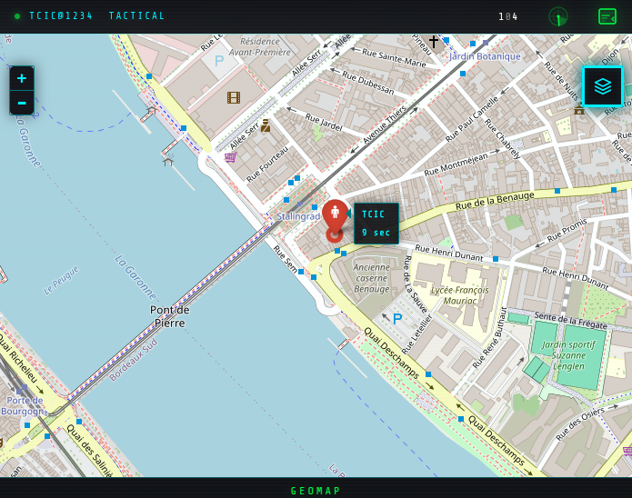

# GeoMap-Air

<p align="center">
  
</p>

Anonymous, real-time geolocation sharing on an interactive map. Join a channel, share your position, exchange messages - no account required, no data stored.

**License:** [GPL v3](https://www.gnu.org/licenses/gpl-3.0.html) | **Status:** Active

## Overview

GeoMap-Air lets users share their GPS position in real time with other participants on the same channel. Each session is identified by a callsign (username) and a numeric channel code (1111-99999). All users on the same channel see each other on an interactive map and can exchange short messages.

The application follows a zero-footprint philosophy: no tracking, no persistent records, no user accounts.

## Features

- **Real-time geolocation** - positions update automatically via the browser Geolocation API
- **Channel-based groups** - users on the same channel see each other; no cross-channel visibility
- **Interactive map** - powered by Leaflet with six tile layers (OpenStreetMap, OpenTopoMap, Esri Satellite, CartoDB Dark, CartoDB Light, Stamen Watercolor)
- **Messaging** - short text messages shared between channel members
- **Sound notifications** - audio alerts for new users joining and incoming messages
- **Marker clustering** - overlapping markers are grouped for readability
- **GPS status indicators** - animated HUD-style icons showing GPS and network state (active, inactive, error, degraded)
- **Mobile-first design** - built on Framework7 with a tactical "Dark Ops" theme
- **Offline fallback** - local marker displayed when the server is unreachable
- **GPX support** - Leaflet GPX plugin available for track overlay

## Documentation

- [ARCHITECTURE.md](ARCHITECTURE.md) - module hierarchy, server endpoints, and tunable globals
- [SECURITY.md](SECURITY.md) - attack surface, threat model, and ANSSI / OWASP compliance
- [ACCESSIBILITY.md](ACCESSIBILITY.md) - RGAA 4.1 conformance statement and improvement plan

## Requirements

### Front-end only (GitHub Pages)

The `www/` directory is a static site deployed automatically to GitHub Pages on every push to `main`. No build step is required.

### Full stack (with server)

Two server implementations are available. Both expose the same API endpoints and are interchangeable from the front-end perspective.

#### Option A: PHP + JSON files (`server-php/`) - recommended for simple deployments

- **PHP** 5.3+ (no database required)
- A web server (Apache, Nginx) with write access to the `data/` directory

#### Option B: PHP + MySQL (`server-sql/`) - for high-traffic deployments

- **PHP** 5.3+ with the `mysqli` extension
- **MySQL** 5.x or compatible (MariaDB)

## Setup

### Option A: PHP + JSON files (server-php)

1. Deploy the `server-php/` directory on your web server.
2. Ensure the `data/` subdirectory is writable by the web server:

```bash
chmod 755 server-php/data
```

3. The `data/.htaccess` file blocks direct HTTP access to JSON files. If you use Nginx, add an equivalent rule to deny access to `server-php/data/`.

That's it - no database, no configuration file to edit.

### Option B: PHP + MySQL (server-sql)

1. Create a MySQL database and run the schema script:

```bash
mysql -u root -p your_database < server-sql/install.sql
```

2. Copy the sample configuration:

```bash
cp server-sql/geomap-server-config-sample.php server-sql/geomap-server-config.php
```

3. Edit `server-sql/geomap-server-config.php` with your database credentials:

```php
define('DB_HOST', 'localhost');
define('DB_NAME', 'geomap');
define('DB_USER', 'your_user');
define('DB_PASSWORD', 'your_password');
```

### Front-end

Point `GLOBAL_SERVER` in the JavaScript to the URL where your PHP server is hosted. The front-end communicates with the server via jQuery AJAX calls to the PHP endpoints.

## Usage

1. Open the application in a browser.
2. Enter a **callsign** (up to 8 characters).
3. Enter a **channel** code (1111-99999).
4. Press **ENGAGE** to join the map.
5. Your position appears on the shared map. Other users on the same channel are visible as markers.
6. Use the toolbar buttons to zoom on all users, zoom on yourself, or clear messages.

## Map layers

| Layer | Source |
|---|---|
| Normal | OpenStreetMap |
| Terrain | OpenTopoMap |
| Hybrid (satellite) | Esri World Imagery |
| Night | CartoDB Dark Matter |
| Tactical | CartoDB Positron |
| Watercolor | Stamen (via Stadia Maps) |

## Deployment

The front-end deploys to GitHub Pages automatically via the workflow in `.github/workflows/pages.yml`. Only the `www/` directory is published.

The PHP server (`server-php/` or `server-sql/`) must be hosted separately on any PHP-compatible environment.

## License

GNU General Public License v3.0 - see [gnu.org/licenses](https://www.gnu.org/licenses/) for details.

## Author

Olivier Booklage
