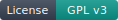
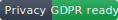
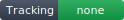
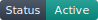
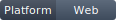

# GeoMap

<p>
  
  
  
  
  
</p>

<p align="center">
  
</p>

Anonymous, real-time location sharing on an interactive map. Join a channel, share your position, exchange short messages - no account required, no data stored.

## Overview

GeoMap lets users share their GPS position in real time with other participants on the same channel. Each session is identified by a callsign (username) and a numeric channel code (1111-99999). All users on the same channel see each other on an interactive map and can exchange short messages.

The application follows a zero-footprint philosophy: no tracking, no persistent records, no user accounts.

## Features

- **Real-time geolocation** - positions update automatically via the browser Geolocation API
- **Channel-based groups** - users on the same channel see each other; no cross-channel visibility
- **Interactive map** - powered by Leaflet with five tile layers (OpenStreetMap, OpenTopoMap, Esri Satellite, CartoDB Dark, CartoDB Light)
- **Messaging** - short text messages shared between channel members
- **Sound notifications** - audio alerts for new users joining and incoming messages
- **Marker clustering** - overlapping markers are grouped for readability
- **GPS status indicators** - animated HUD-style icons showing GPS and network state (active, inactive, error, degraded)
- **Offline fallback** - local marker displayed when the server is unreachable
- **GPX support** - Leaflet GPX plugin available for track overlay

## Documentation

- [ARCHITECTURE.md](ARCHITECTURE.md) - module hierarchy, server endpoints, and tunable globals
- [SECURITY.md](SECURITY.md) - attack surface, threat model, and ANSSI / OWASP compliance
- [ACCESSIBILITY.md](ACCESSIBILITY.md) - RGAA 4.1 conformance statement and improvement plan

## Requirements

### Front-end (any static host)

The `www/` directory is a self-contained static site that runs on any web server able to serve plain files (Apache, Nginx, lighttpd, the PHP built-in server, GitHub Pages, etc.). No build step is required. The repository ships a workflow that publishes `www/` to GitHub Pages on every push to `main` as a convenience, but that path is optional.

### Full stack (with server)

Two server implementations are available. Both expose the same API endpoints and are interchangeable from the front-end perspective.

#### Option A: PHP + JSON files (`server-php/`) - recommended for simple deployments

- **PHP** 5.3+ (no database required)
- A web server (Apache, Nginx) with write access to the `data/` directory

#### Option B: PHP + MySQL (`server-sql/`) - for high-traffic deployments

- **PHP** 5.3+ with the `mysqli` extension
- **MySQL** 5.x or compatible (MariaDB)

## Setup

### Option A: PHP + JSON files (server-php)

1. Deploy the `server-php/` directory on your web server.
2. Ensure the `data/` subdirectory is writable by the web server:

```bash
chmod 755 server-php/data
```

3. The `data/.htaccess` file blocks direct HTTP access to JSON files. If you use Nginx, add an equivalent rule to deny access to `server-php/data/`.

That's it - no database, no configuration file to edit.

### Option B: PHP + MySQL (server-sql)

1. Create a MySQL database and run the schema script:

```bash
mysql -u root -p your_database < server-sql/install.sql
```

2. Copy the sample configuration:

```bash
cp server-sql/geomap-server-config-sample.php server-sql/geomap-server-config.php
```

3. Edit `server-sql/geomap-server-config.php` with your database credentials:

```php
define('DB_HOST', 'localhost');
define('DB_NAME', 'geomap');
define('DB_USER', 'your_user');
define('DB_PASSWORD', 'your_password');
```

### Front-end

Point `GLOBAL_SERVER` in the JavaScript to the URL where your PHP server is hosted. The front-end communicates with the server via jQuery AJAX calls to the PHP endpoints.

## Usage

1. Open the application in a browser.
2. Enter a **callsign** (up to 8 characters).
3. Enter a **channel** code (1111-99999).
4. Press **ENGAGE** to join the map.
5. Your position appears on the shared map. Other users on the same channel are visible as markers.
6. Use the toolbar buttons to zoom on all users, zoom on yourself, or clear messages.

## Map layers

| Layer | Source |
|---|---|
| Normal | OpenStreetMap |
| Terrain | OpenTopoMap |
| Hybrid (satellite) | Esri World Imagery |
| Night | CartoDB Dark Matter |
| Tactical | CartoDB Positron |

## Deployment

The front-end deploys to GitHub Pages automatically via the workflow in `.github/workflows/pages.yml`. Only the `www/` directory is published.

The PHP server (`server-php/` or `server-sql/`) must be hosted separately on any PHP-compatible environment.

## Local development

Both the front-end and the JSON back-end can be served from a single PHP built-in server, with no other tooling required:

```bash
php -S localhost:8000
```

Run it from the project root, then open:

- Front-end: <http://localhost:8000/www/>
- Back-end:  <http://localhost:8000/server-php/>

In the **Server** field of the front-end home page, set the back-end URL to `http://localhost:8000/server-php` and tap Connect.

To smoke-test the back-end alone, request `http://localhost:8000/server-php/geomap-server-info.php?mission=1234` in any browser; it should return a JSON payload.

## Third-party libraries

All third-party libraries are vendored locally under `www/vendor/`; no CDN is loaded at runtime. Each is used as released by its upstream author.

| Library | Role | License | Project |
|---------|------|---------|---------|
| jQuery 1.9.1 | DOM and AJAX | MIT | [jquery.com](https://jquery.com/) |
| Leaflet | Interactive map engine | BSD 2-Clause | [leafletjs.com](https://leafletjs.com/) |
| Leaflet.label | Persistent marker labels | BSD 2-Clause | [github.com/Leaflet/Leaflet.label](https://github.com/Leaflet/Leaflet.label) |
| Leaflet.markercluster | Marker clustering | MIT | [github.com/Leaflet/Leaflet.markercluster](https://github.com/Leaflet/Leaflet.markercluster) |
| Leaflet.awesome-markers | Coloured marker icons | MIT | [github.com/lvoogdt/Leaflet.awesome-markers](https://github.com/lvoogdt/Leaflet.awesome-markers) |
| Leaflet.draw | Drawing tools | MIT | [github.com/Leaflet/Leaflet.draw](https://github.com/Leaflet/Leaflet.draw) |
| Leaflet.GPX | GPX track overlay | BSD 2-Clause | [github.com/mpetazzoni/leaflet-gpx](https://github.com/mpetazzoni/leaflet-gpx) |
| Leaflet GeoSearch | Address search | MIT | [github.com/smeijer/leaflet-geosearch](https://github.com/smeijer/leaflet-geosearch) |
| Overlapping Marker Spiderfier | Spread overlapping markers | MIT | [github.com/jawj/OverlappingMarkerSpiderfier-Leaflet](https://github.com/jawj/OverlappingMarkerSpiderfier-Leaflet) |
| Framework7 | Mobile UI framework | MIT | [framework7.io](https://framework7.io/) |
| SoundManager 2 | Audio playback | BSD 2-Clause | [schillmania.com/projects/soundmanager2](http://www.schillmania.com/projects/soundmanager2/) |
| QRCode.js | QR code rendering | MIT | [github.com/davidshimjs/qrcodejs](https://github.com/davidshimjs/qrcodejs) |
| Font Awesome 4 | Icon set | MIT (code), SIL OFL 1.1 (font) | [fontawesome.com](https://fontawesome.com/v4/) |

Map tiles are fetched at runtime from the providers listed in [Map layers](#map-layers); they are not part of this repository. Each provider has its own usage policy and attribution requirements which are surfaced in the Leaflet attribution control on the map.

## License

GNU General Public License v3.0 - see [gnu.org/licenses](https://www.gnu.org/licenses/) for details.

## Author

Olivier Booklage
